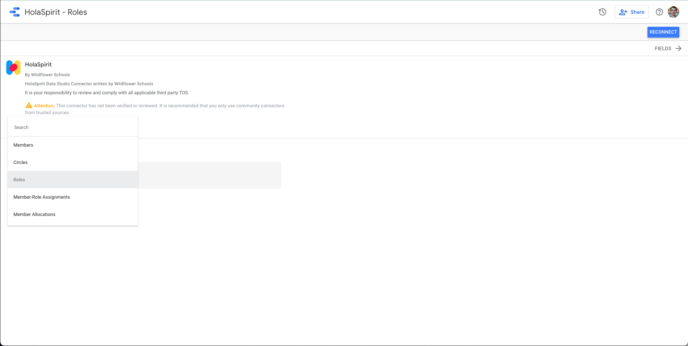
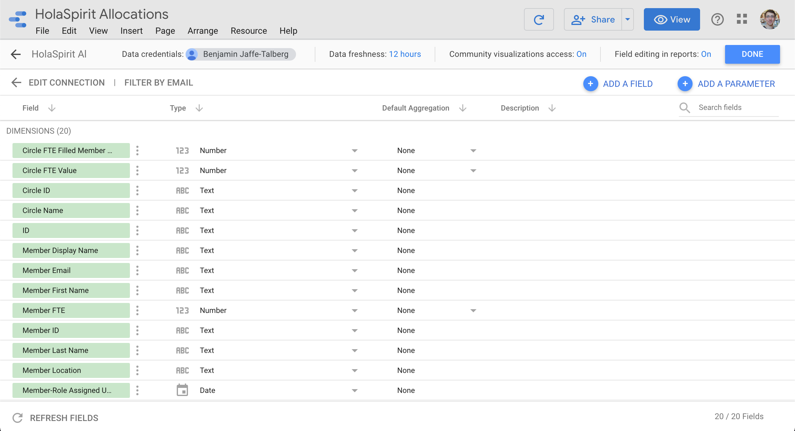
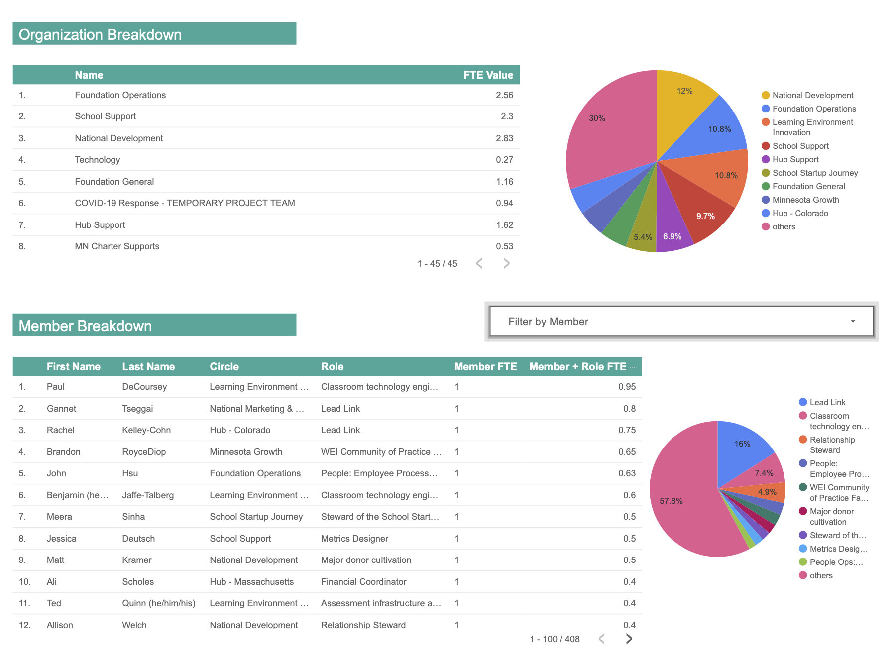

## WF HolaSpirit Community Connector

A Data Studio Community Connector for the HolaSpirit API.

Originally inspired by need to on-demand break down FTE allocation by circle and member.

### Options

* Username/Password Auth
* Data Sources Included:
    * Members
    * Circles
    * Roles
    * Member Allocations (de-normalized combination of members/circles/roles)
* Simple [CacheService based Caching](https://developers.google.com/apps-script/reference/cache/cache-service#getScriptCache())

### Screenshots

### Code

Written in App Script and deployed with [Clasp](https://github.com/google/clasp).
